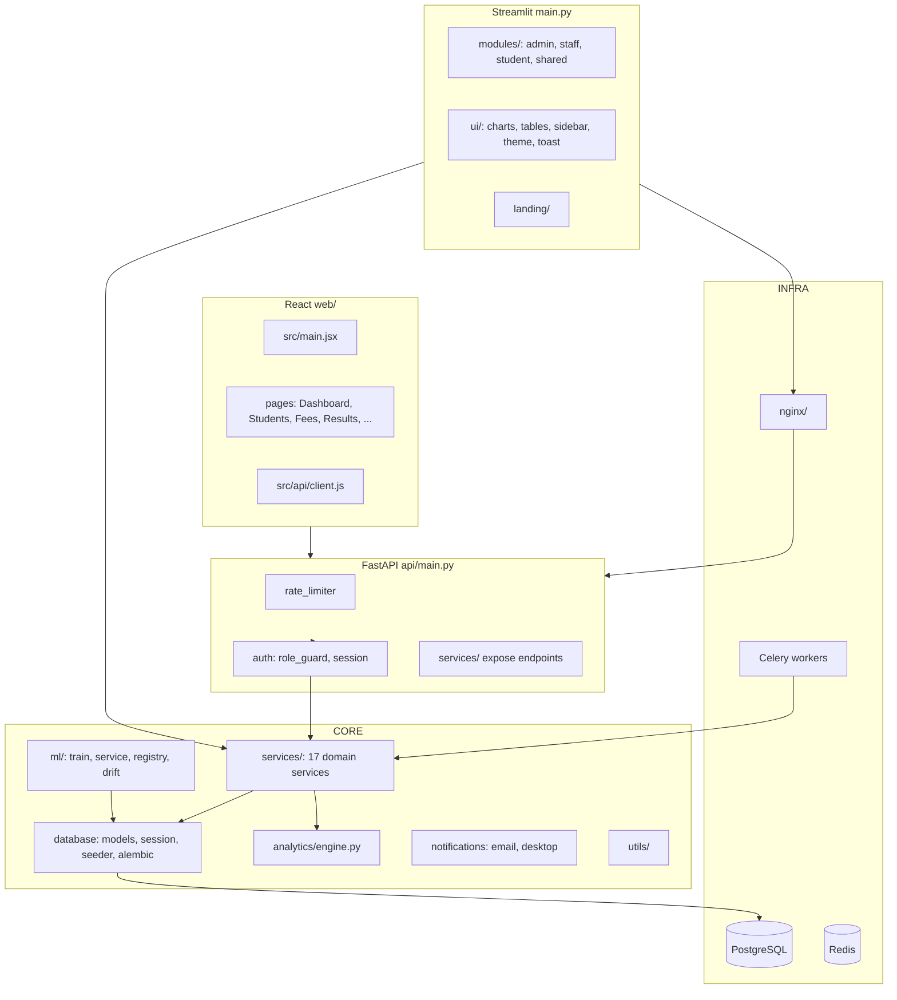

# BBIMS — Architecture

> Textual architecture of the Institute Management System (as-is; no behavior changes).

## System Overview

BBIMS is a role-based institute management platform with four surfaces:

1. **Streamlit UI** (`main.py` + `modules/` + `ui/`) — role-based dashboards for admin/staff/student.
2. **FastAPI** (`api/main.py`) — REST API with JWT auth, rate limiting, and RBAC guards.
3. **React SPA** (`web/`) — Vite + React frontend consuming the same API.
4. **Workers & ML** — Celery background jobs + XGBoost risk-scoring pipeline.



## Layering Rules (as observed)

- **Modules** (Streamlit pages) call **services** — no direct SQL in UI code.
- **Services** encapsulate business logic and own DB access via `database/`.
- **API** adds auth/rate-limiting around services.
- **ML** pipeline is separate (`ml/`) with its own registry and drift detection.
- **Config** centralized in `config/settings.py` (env-driven).

## Data Flow (risk-scoring path)

```
student data ──► features (ml/features.py) ──► XGBoost risk_v1 ──► risk score
                                                    │
                             drift detection (ml/drift.py) ──► retrain trigger
```

## Deployment

- Docker: `Dockerfile` (app) + `Dockerfile.worker` (Celery) + `nginx/` + `docker-compose.yml`.
- PostgreSQL with Alembic migrations (`database/alembic/`); Redis for tokens/queues.
- CI: lint (ruff+black), tests w/ coverage ≥70%, security (bandit, pip-audit).
