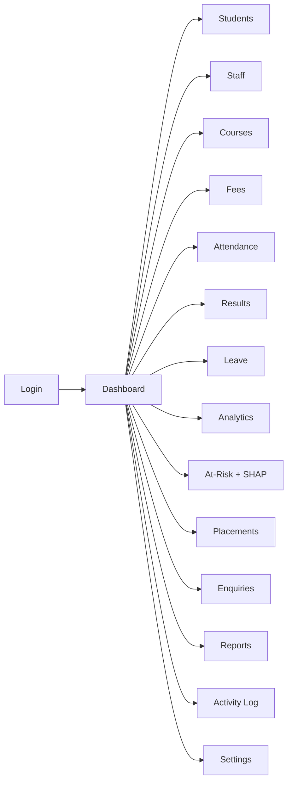
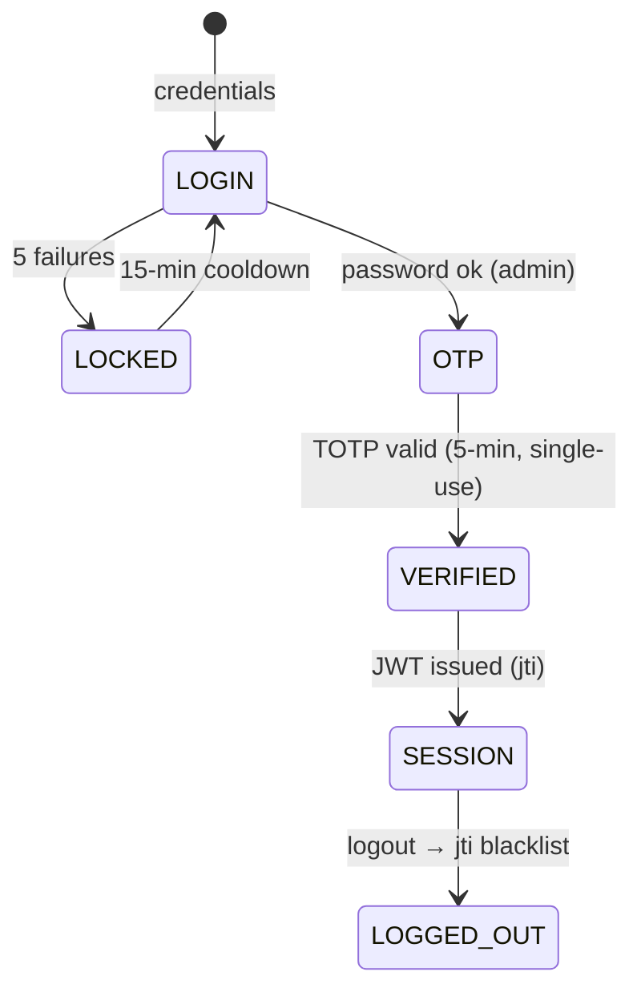
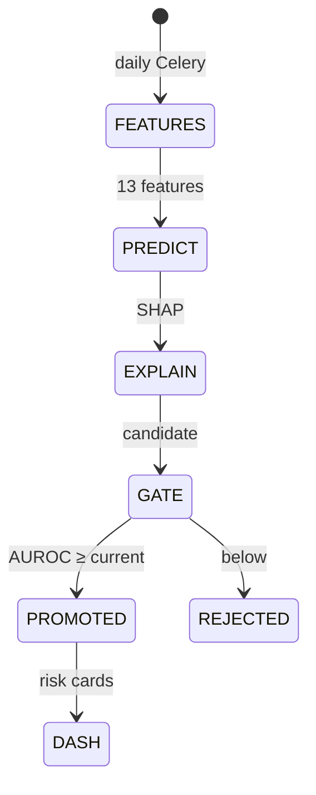

# AppFlow — BB-IMS: Application Flow

| Field | Value |
| --- | --- |
| Version | v0.1 |
| Last Updated | 2026-08-06 |
| Owner | PM / QA |
| Status | In Review |

---

## 1. Screen Inventory

Desktop client (37 screens, grouped):

| SCR-### | Screen Group | Count | Purpose | Auth |
| --- | --- | --- | --- | --- |
| SCR-001..017 | Admin screens | 17 | Dashboard, Students, Staff, Courses, Subjects, Sessions, Leave, Fees, Notice Board, Timetable, Analytics, Staff Attendance, Placement, Enquiry, Reports, Activity Log, Settings | Admin |
| SCR-018..025 | Staff screens | 8 | Dashboard, Attendance Taker, Results, Student Lookup, My Attendance, Leave, Feedback, Profile | Staff |
| SCR-026..032 | Student screens | 7 | Dashboard, Attendance, Results, Fees, Leave, Feedback, Profile | Student |
| SCR-033..037 | Shared screens | 5 | Profile, Settings, Leave Apply, Feedback, Notice Viewer | All |

Web dashboard (React SPA): login, dashboard KPIs, command palette, students, staff, courses, fees, results, attendance, leave, analytics (Recharts), risk cards.

## 2. Navigation Map (web + desktop)

## 3. Detailed Flow per Journey

### Auth (2FA)

### At-risk flow

## 4. Empty / Loading / Error States

| Screen | Empty | Loading | Error |
| --- | --- | --- | --- |
| Students | "No students" | skeleton | API error toast |
| Analytics | "No data" | spinner | — |
| At-Risk | "No predictions" | — | model error |
| Desktop any | "No records" | — | DB error dialog |

## 5. Edge Cases & Branching Logic

| IF condition | THEN route |
| --- | --- |
| No token | 401 (aligned to 403 for some guards — see RiskRegister) |
| Token blacklisted (jti) | 401 |
| 5 failed logins | 15-min lockout |
| OTP expired (>5 min) | Re-request |
| PSI > 0.10 | Flag drift |
| PSI > 0.25 | Severe drift alert |
| Desktop offline | Local SQLite writes, sync later |

## 6. Notifications & Re-engagement

| Trigger | Channel | Destination |
| --- | --- | --- |
| Daily at-risk run | Dashboard + email | admin |
| Drift detected | Celery alert | admin |
| Leave request | In-app | approver |

## 7. Cross-Platform Deltas

| Feature | Desktop | Web |
| --- | --- | --- |
| Full admin (17 screens) | ✅ | Partial (React SPA) |
| Offline operation | ✅ | ❌ |
| Analytics charts | Matplotlib/Seaborn | Recharts |
| SHAP cards | ✅ | ✅ |

## 8. Related Documents

| Document | Relationship |
| --- | --- |
| [PRD.md](../product/PRD.md) | US-001…008 |
| [TechSpec.md](../technical/TechSpec.md) | Components |
| [Design.md](Design.md) | Screens |
| [Schema.md](../technical/Schema.md) | Entities |
| [ImplementationPlan.md](../project/ImplementationPlan.md) | Tasks |
| [Tracker.md](../project/Tracker.md) | Status |
| [Rules.md](../project/Rules.md) | Standards |
| [API.md](../technical/API.md) | Endpoints |
| [SecurityAndCompliance.md](../technical/SecurityAndCompliance.md) | Security |
| [Testing.md](../technical/Testing.md) | Tests |
| [Deployment.md](../technical/Deployment.md) | Env |
| [Glossary.md](../reference/Glossary.md) | Vocabulary |
| [RiskRegister.md](../project/RiskRegister.md) | Risks |
