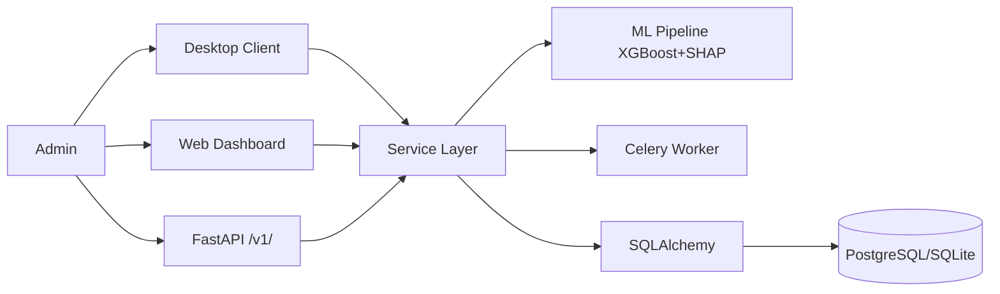

# PRD — Binary Brain Institute Management System (BB-IMS)

| Field | Value |
| --- | --- |
| Version | v0.1 |
| Last Updated | 2026-08-06 |
| Owner | Product Manager |
| Status | In Review |

---

## 1. Executive Summary

BB-IMS is a comprehensive educational institute management platform for small-to-medium coaching institutes, private schools, and training centers. It manages the full institute lifecycle through three interfaces — a CustomTkinter desktop client (37 screens), a React 19 web dashboard, and a FastAPI REST API (50+ endpoints) — all sharing a single business logic layer. It includes an XGBoost ML pipeline for at-risk student prediction with SHAP explainability, PSI drift detection, JWT auth with jti blacklisting, OTP 2FA, and role-based access control.

## 2. Problem Statement

- **User pain:** Small institutes juggle students, staff, courses, fees, attendance, results, and placements across spreadsheets and disconnected tools.
- **Evidence/context:** 37 desktop screens, 50+ API endpoints, 5,000+ seeded demo records, 348+ tests.
- **Cost of not solving it:** Missed at-risk students, fee leakage, no audit trail, manual admin work.

## 3. Goals & Non-Goals

| Goal | Metric | Target |
| --- | --- | --- |
| Single source of truth | All interfaces share business logic | 100% |
| At-risk prediction | AUROC | ≥ 0.90 (target) |
| Explainability | SHAP on every prediction | 100% |
| Security | RBAC + IDOR prevention | enforced on all endpoints |
| Test health | pytest + Vitest | 348+ / 31+ passing |

### Non-Goals (v1)
- Online payment processing.
- Parent-facing mobile app.
- Full LMS (course content delivery).
- Multi-branch (single institute).

## 4. Target Users & Personas

| Persona | Role | Goals | Frustrations | Quote | Tech Comfort |
| --- | --- | --- | --- | --- | --- |
| Meera — Admin | Runs the institute | Students, fees, staff, reports | Scattered tools | "Show me who's at risk." | Medium |
| Rohan — Staff/Teacher | Takes attendance, results | Quick bulk entry | Slow forms | "Mark all in one go." | Medium |
| Ankit — Student | Checks attendance/results/fees | Self-service | Long queues | "Can I see my status?" | Low |
| Dev — Operator | Uses desktop client | Offline-capable ops | Web dependency | "Works without internet." | Low |

## 5. User Stories

| ID | As a... | I want... | So that... | Priority | Acceptance Criteria |
| --- | --- | --- | --- | --- | --- |
| US-001 | Admin | student CRUD | I manage enrollment | P0 | CRUD + pagination |
| US-002 | Admin | fee management | I track collections | P0 | Fees + collection rate |
| US-003 | Staff | bulk attendance | I save time | P0 | Bulk POST |
| US-004 | Staff | bulk results | I enter marks fast | P0 | Bulk POST |
| US-005 | Admin | at-risk predictions with reasons | I intervene early | P1 | SHAP cards |
| US-006 | Admin | analytics dashboard | I see health | P1 | KPIs + charts |
| US-007 | All | secure auth + 2FA | I stay protected | P0 | JWT + OTP |
| US-008 | Admin | placement manager + enquiries | I track outcomes | P2 | CRUD |

## 6. Feature List

| ID | Epic | Feature | Description | Priority | Status |
| --- | --- | --- | --- | --- | --- |
| REQ-001 | Desktop | 37 screens (admin/staff/student/shared) | Full offline client | P0 | Done |
| REQ-002 | Web | React SPA | Dark mode, command palette, KPIs | P0 | Done |
| REQ-003 | API | 50+ REST endpoints | Full CRUD + analytics | P0 | Done |
| REQ-004 | Auth | JWT + jti + OTP 2FA | Secure access | P0 | Done |
| REQ-005 | Auth | Rate limiting + lockout | Brute-force defense | P0 | Done |
| REQ-006 | ML | XGBoost at-risk model | 13 features, SHAP | P1 | Done |
| REQ-007 | ML | PSI drift detection | Daily Celery task | P1 | Done |
| REQ-008 | Ops | Celery + Redis background | Emails, retrain | P1 | Done |
| REQ-009 | Reports | Reports center | Printable reports | P1 | Done |
| REQ-010 | Security | 7 security headers + IDOR | Hardened | P0 | Done |

## 7. User Journeys (high level)

## 8. Success Metrics / KPIs

| Metric | Target | Measurement |
| --- | --- | --- |
| North Star: at-risk students caught | ≥ 80% of true at-risk | ML eval |
| Collection rate | ≥ 90% (target) | Fee reports |
| Endpoint security | 0 IDOR/privilege issues | tests |
| Test health | 348+ pytest, 31+ Vitest | CI |

## 9. Assumptions & Dependencies

- PostgreSQL in prod, SQLite (WAL) local.
- Redis + Celery for background.
- React 19 + Vite for web.
- `SECRET_KEY` env required.

## 10. Risks

Top 3 (full list in ../project/RiskRegister.md):
1. **Auth status-code inconsistency (403 vs 401)** — documented; tests to be aligned.
2. **At-risk model bias/small data** — mitigated by promotion gate + PSI drift.
3. **Tri-interface divergence** — mitigated by shared service layer.

## 11. Release Criteria

- [ ] All 3 interfaces share one logic layer.
- [ ] 348+ pytest + 31+ Vitest pass.
- [ ] At-risk pipeline with SHAP + promotion gate.
- [ ] Security headers + RBAC + IDOR tests.
- [ ] Docker Compose boots web + API + Celery.

## 12. Open Questions

| Question | Owner | Resolve by |
| --- | --- | --- |
| Standardize 401 vs 403 behavior across endpoints? | Eng Lead | Release 1.1 |
| Online payment integration? | PM | Release 2.0 |

## 13. Related Documents

| Document | Relationship |
| --- | --- |
| [TechSpec.md](../technical/TechSpec.md) | Architecture |
| [AppFlow.md](../design/AppFlow.md) | Screens/flows |
| [Design.md](../design/Design.md) | Design system |
| [Schema.md](../technical/Schema.md) | Data model |
| [ImplementationPlan.md](../project/ImplementationPlan.md) | Build plan |
| [Tracker.md](../project/Tracker.md) | Task status |
| [Rules.md](../project/Rules.md) | Standards |
| [API.md](../technical/API.md) | Endpoints |
| [SecurityAndCompliance.md](../technical/SecurityAndCompliance.md) | Security |
| [Testing.md](../technical/Testing.md) | Tests |
| [Deployment.md](../technical/Deployment.md) | Deployment |
| [Glossary.md](../reference/Glossary.md) | Vocabulary |
| [RiskRegister.md](../project/RiskRegister.md) | Risks |
