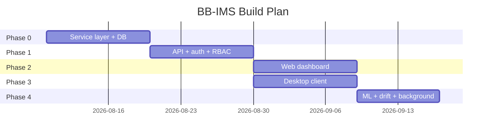
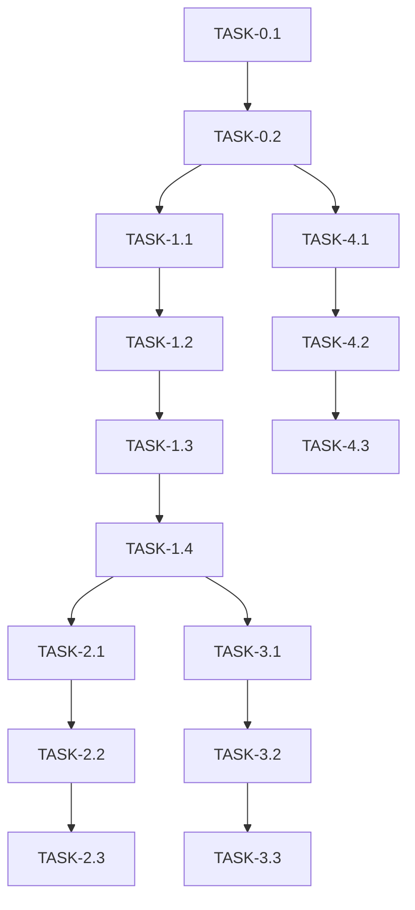

# ImplementationPlan — BB-IMS: Phased Build Plan

| Field | Value |
| --- | --- |
| Version | v0.1 |
| Last Updated | 2026-08-06 |
| Owner | Engineering Lead |
| Status | In Review |

---

## 1. Build Philosophy

Shared-core first: build the service layer + API once, then bind both UIs to it. ML pipeline added after core CRUD is stable. Security gates (RBAC, IDOR, rate limits) enforced from the first endpoint.

## 2. Phase Overview

## 3. Phase Breakdown

### Phase 0: Core
- Goal: service layer + schema.
- Exit: seed 5,000 records.

| TASK-# | Description | Depends on | Owner | Est. | Maps to |
| --- | --- | --- | --- | --- | --- |
| TASK-0.1 | SQLAlchemy models + Alembic | — | Eng | 5d | REQ-003, TBL-* |
| TASK-0.2 | 17 service modules | TASK-0.1 | Eng | 5d | REQ-003 |

### Phase 1: API
- Goal: 50+ endpoints + auth.
- Exit: auth + RBAC tests green.

| TASK-# | Description | Depends on | Owner | Est. | Maps to |
| --- | --- | --- | --- | --- | --- |
| TASK-1.1 | FastAPI scaffold + security headers | TASK-0.2 | Eng | 3d | REQ-010 |
| TASK-1.2 | JWT + jti + OTP 2FA | TASK-1.1 | Eng | 4d | REQ-004 |
| TASK-1.3 | Rate limits + lockout | TASK-1.2 | Eng | 2d | REQ-005 |
| TASK-1.4 | Core CRUD endpoints + RBAC | TASK-1.3 | Eng | 5d | REQ-003, US-001/002 |

### Phase 2: Web
- Goal: React SPA.
- Exit: dashboard + palette + risk cards.

| TASK-# | Description | Depends on | Owner | Est. | Maps to |
| --- | --- | --- | --- | --- | --- |
| TASK-2.1 | React scaffold + auth flow | TASK-1.4 | FE | 4d | REQ-002 |
| TASK-2.2 | Dashboard + analytics (Recharts) | TASK-2.1 | FE | 4d | US-006 |
| TASK-2.3 | CRUD screens + risk cards | TASK-2.2 | FE | 4d | REQ-002 |

### Phase 3: Desktop
- Goal: 37-screen CustomTkinter client.
- Exit: offline CRUD works.

| TASK-# | Description | Depends on | Owner | Est. | Maps to |
| --- | --- | --- | --- | --- | --- |
| TASK-3.1 | Desktop shell + navigation | TASK-1.4 | FE | 4d | REQ-001 |
| TASK-3.2 | Admin 17 screens | TASK-3.1 | FE | 5d | REQ-001 |
| TASK-3.3 | Staff/student/shared screens | TASK-3.2 | FE | 4d | REQ-001 |

### Phase 4: ML & Ops
- Goal: at-risk + drift + Celery.
- Exit: promotion gate + PSI live.

| TASK-# | Description | Depends on | Owner | Est. | Maps to |
| --- | --- | --- | --- | --- | --- |
| TASK-4.1 | XGBoost + SHAP pipeline | TASK-0.2 | ML | 4d | REQ-006 |
| TASK-4.2 | Promotion gate + history | TASK-4.1 | ML | 2d | REQ-006 |
| TASK-4.3 | PSI drift + Celery daily | TASK-4.2 | ML | 3d | REQ-007, REQ-008 |

## 4. Dependency Graph

## 5. Environment & Tooling Setup Checklist

- [ ] `pip install -r requirements.txt`
- [ ] `export SECRET_KEY=...` + `ENV=development`
- [ ] `python main.py` (desktop, seeds DB)
- [ ] `uvicorn api.main:app --reload --port 8000`
- [ ] `cd web && npm install && npm run dev`
- [ ] Docker: `docker-compose up -d`

## 6. Rollout Strategy

- Feature flag: risk thresholds via `PUT /v1/admin/config/risk-thresholds`.
- Canary: staging first.
- Rollback: image revert + Alembic downgrade policy.

## 7. Definition of Done (global)

- [ ] Tests pass (pytest + Vitest)
- [ ] Docs updated (this suite)
- [ ] Reviewed
- [ ] Security: RBAC + IDOR + headers verified
- [ ] ML: promotion gate enforced

## 8. Related Documents

| Document | Relationship |
| --- | --- |
| [PRD.md](../product/PRD.md) | REQ mapping |
| [TechSpec.md](../technical/TechSpec.md) | Components |
| [AppFlow.md](../design/AppFlow.md) | Flows |
| [Schema.md](../technical/Schema.md) | Data |
| [Design.md](../design/Design.md) | UI tasks |
| [Tracker.md](Tracker.md) | Status |
| [Rules.md](Rules.md) | Standards |
| [API.md](../technical/API.md) | Contract |
| [SecurityAndCompliance.md](../technical/SecurityAndCompliance.md) | Security |
| [Testing.md](../technical/Testing.md) | Tests |
| [Deployment.md](../technical/Deployment.md) | Rollout |
| [Glossary.md](../reference/Glossary.md) | Vocabulary |
| [RiskRegister.md](RiskRegister.md) | Risks |
