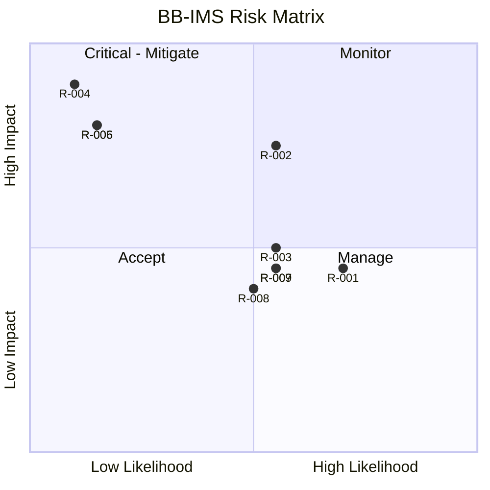

# RiskRegister — BB-IMS: Known Risks

| Field | Value |
| --- | --- |
| Version | v0.1 |
| Last Updated | 2026-08-06 |
| Owner | PM / Eng Lead |
| Status | In Review |

---

| Risk | Likelihood | Impact | Score | Mitigation | Owner | Status |
| --- | --- | --- | --- | --- | --- | --- |
| R-001 Auth 401/403 inconsistency | High | Medium | 4 | Align guards; fix BLK-001 | Eng | 🔴 Open |
| R-002 At-risk model bias/small data | Medium | High | 6 | Promotion gate + PSI drift | ML | Mitigating |
| R-003 Tri-interface divergence | Medium | Medium | 4 | Shared service layer (rule) | Eng | Mitigating |
| R-004 JWT compromise | Low | Critical | 8 | jti blacklist + rotation + OTP | Security | Mitigating |
| R-005 IDOR/privilege escalation | Low | High | 5 | RBAC + IDOR tests | Security | Mitigating |
| R-006 SQL injection | Low | High | 5 | ORM + no raw SQL | Security | Mitigating |
| R-007 Offline desktop schema drift | Medium | Medium | 4 | Alembic + local migration | Eng | Open |
| R-008 Celery/Redis outage | Medium | Medium | 4 | Sync fallback for critical jobs | DevOps | Accepted |
| R-009 Large seeded data perf | Medium | Medium | 4 | Indexes + pagination | Eng | Open |

## Risk Matrix

## Related Documents

| Document | Relationship |
| --- | --- |
| [PRD.md](../product/PRD.md) | Top-3 risks |
| [SecurityAndCompliance.md](../technical/SecurityAndCompliance.md) | R-004/005/006 |
| [TechSpec.md](../technical/TechSpec.md) | R-002/003 |
| [AppFlow.md](../design/AppFlow.md) | Flows |
| [Design.md](../design/Design.md) | Design |
| [Schema.md](../technical/Schema.md) | Data |
| [ImplementationPlan.md](ImplementationPlan.md) | Mitigations |
| [Tracker.md](Tracker.md) | BLK-001 |
| [Rules.md](Rules.md) | Standards |
| [API.md](../technical/API.md) | R-001 |
| [Testing.md](../technical/Testing.md) | Test coverage |
| [Deployment.md](../technical/Deployment.md) | Rollback |
| [Glossary.md](../reference/Glossary.md) | Vocabulary |
