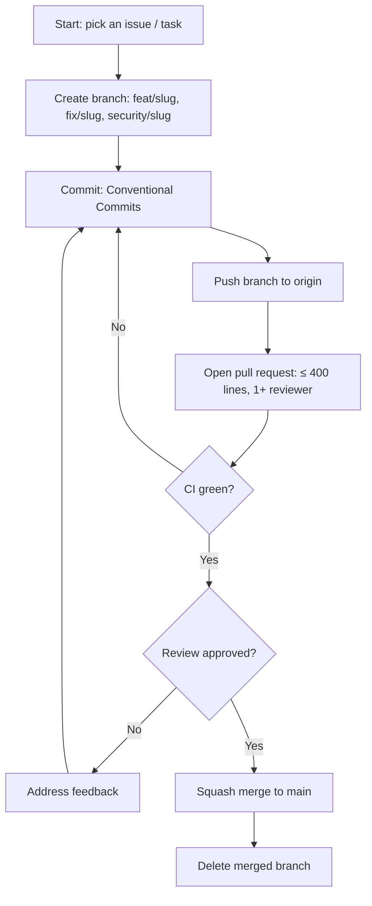

# Rules — BB-IMS: Coding Standards & AI-Agent Operating Rules

| Field | Value |
| --- | --- |
| Version | v0.1 |
| Last Updated | 2026-08-06 |
| Owner | Engineering Lead |
| Status | In Review |

---

## 1. Guiding Principles

1. One business logic layer for all three interfaces.
2. Readability over cleverness.
3. No silent failures — standardized ErrorCode responses.
4. Security first — RBAC + IDOR + validation on every endpoint.
5. Small PRs only.
6. Tests accompany behavior changes.
7. ML changes go through the promotion gate.

## 2. Code Style

- Python 3.10+, type hints; formatter black; linter ruff, isort, mypy, bandit.
- TypeScript/React: strict mode, ESLint + Prettier.
- Structure:

```
main.py               # desktop entry
api/main.py           # FastAPI
web/                  # React SPA
celery_app.py         # Celery
ml/                   # XGBoost + SHAP + drift
services/             # 17 shared business modules
database/             # SQLAlchemy models, migrations, seeder
modules/              # 35 desktop screens
tests/
```

## 3. Git Workflow

- Branches: `feat/<slug>`, `fix/<slug>`, `security/<slug>`.
- Commits: Conventional Commits.
- PRs: ≤ 400 lines; CI green; 1+ reviewer.
- Merge: squash to main.

## 4. Testing Requirements

- pytest 348+ backend; Vitest 31+ frontend.
- MUST have tests: auth/JWT/jti, RBAC + IDOR, rate limits, OTP, ML promotion gate, PSI drift, API contracts.
- See [Testing.md](../technical/Testing.md).

## 5. AI Agent Operating Rules

- Always read Tracker.md and ImplementationPlan.md before starting.
- Never mark a task 🟢 Done without tests passing.
- Never invent requirements not in ../product/PRD.md/../technical/TechSpec.md — flag ambiguity.
- Always update ../technical/Schema.md when migrations change.
- Never commit secrets; env vars per ../technical/SecurityAndCompliance.md.
- Cross-check ../design/Design.md before building UI.
- State conflicts rather than silently picking one.

## 6. Security Baseline Rules

- JWT with jti blacklisting; bcrypt cost 14.
- OTP SHA-256 hashed, 5-min TTL, single-use.
- Rate limiting sliding-window per endpoint.
- 7 security headers (HSTS, CSP, X-Frame-Options…).
- Upload MIME + magic-byte validation.
- No raw SQL string concatenation.

## 7. Documentation Rules

- Migration changes → ../technical/Schema.md same PR.
- New endpoints → ../technical/API.md same PR.
- New env vars → ../technical/Deployment.md.

## 8. Prohibited Patterns

| Anti-pattern | Why |
| --- | --- |
| Business logic duplicated per interface | Divergence |
| `except: pass` | Silent failure |
| Raw SQL f-strings | Injection |
| Storing JWT in localStorage | XSS risk |
| Promoting models without gate | Drift |

## 9. Escalation Rules

**Ask a human when:** schema migrations, security incidents, ML promotion, scope changes.
**Decide autonomously:** refactors within service layer, tests, UI polish.

## Git / PR Workflow



## 10. Related Documents

| Document | Relationship |
| --- | --- |
| [Testing.md](../technical/Testing.md) | Test requirements |
| [SecurityAndCompliance.md](../technical/SecurityAndCompliance.md) | Security |
| [PRD.md](../product/PRD.md) | Requirements |
| [TechSpec.md](../technical/TechSpec.md) | Architecture |
| [AppFlow.md](../design/AppFlow.md) | Flows |
| [Design.md](../design/Design.md) | Design |
| [Schema.md](../technical/Schema.md) | Data |
| [ImplementationPlan.md](ImplementationPlan.md) | Tasks |
| [Tracker.md](Tracker.md) | Status |
| [API.md](../technical/API.md) | Contract |
| [Deployment.md](../technical/Deployment.md) | Env vars |
| [Glossary.md](../reference/Glossary.md) | Vocabulary |
| [RiskRegister.md](RiskRegister.md) | Risks |
