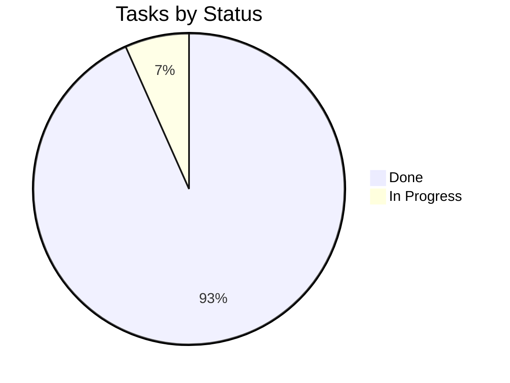

# Tracker — BB-IMS: Living Status Tracker

| Field | Value |
| --- | --- |
| Version | v0.1 |
| Last Updated | 2026-08-06 |
| Owner | Engineering Lead |
| Status | In Review |

---

## 1. Snapshot Dashboard

| Metric | Value |
| --- | --- |
| Overall % Complete | 75% |
| Current Phase | Phase 4 |
| Tasks Done / Total | 12 / 15 |
| Blockers (open) | 1 |
| Days to Target Launch | 20 |

## 2. Status Legend

🟢 Done | 🟡 In Progress | 🔴 Blocked | ⚪ Not Started | 🔵 In Review

## 3. Phase Progress Bars

| Phase | Progress |
| --- | --- |
| Phase 0: Core | `[████████░░] 100%` |
| Phase 1: API | `[████████░░] 100%` |
| Phase 2: Web | `[████████░░] 100%` |
| Phase 3: Desktop | `[████████░░] 100%` |
| Phase 4: ML & Ops | `[████░░░░░░] 50%` |

## 4. Full Task Table

| TASK | Description | Status | Assignee | Start | Target | Actual | Notes |
| --- | --- | --- | --- | --- | --- | --- | --- |
| TASK-0.1 | Models + Alembic | 🟢 | Eng | 2026-06-01 | 2026-06-07 | — |  |
| TASK-0.2 | Service modules | 🟢 | Eng | 2026-06-07 | 2026-06-14 | — |  |
| TASK-1.1 | API scaffold | 🟢 | Eng | 2026-06-15 | 2026-06-18 | — |  |
| TASK-1.2 | JWT + OTP | 🟢 | Eng | 2026-06-18 | 2026-06-24 | — |  |
| TASK-1.3 | Rate limits + lockout | 🟢 | Eng | 2026-06-24 | 2026-06-26 | — |  |
| TASK-1.4 | CRUD + RBAC | 🟢 | Eng | 2026-06-26 | 2026-07-03 | — |  |
| TASK-2.1 | React scaffold | 🟢 | FE | 2026-07-04 | 2026-07-09 | — |  |
| TASK-2.2 | Dashboard + analytics | 🟢 | FE | 2026-07-09 | 2026-07-15 | — |  |
| TASK-2.3 | CRUD + risk cards | 🟢 | FE | 2026-07-15 | 2026-07-21 | — |  |
| TASK-3.1 | Desktop shell | 🟢 | FE | 2026-07-04 | 2026-07-09 | — |  |
| TASK-3.2 | Admin screens | 🟢 | FE | 2026-07-09 | 2026-07-16 | — |  |
| TASK-3.3 | Staff/student screens | 🟢 | FE | 2026-07-16 | 2026-07-22 | — |  |
| TASK-4.1 | XGBoost + SHAP | 🟢 | ML | 2026-07-23 | 2026-07-28 | — |  |
| TASK-4.2 | Promotion gate | 🟢 | ML | 2026-07-28 | 2026-07-30 | — |  |
| TASK-4.3 | PSI drift + Celery | 🟡 | ML | 2026-07-31 | — | — | in progress |

## 5. Blockers Log

| ID | Description | Raised | Owner | Impact | Status |
| --- | --- | --- | --- | --- | --- |
| BLK-001 | Auth guards return 403 where tests expect 401 (3 tests) | 2026-08-01 | Eng | Test suite red | 🔴 Open — align guard behavior |

## 6. Changelog

- 2026-08-06: **Documentation suite complete** — 14-file suite consolidated into `docs/`, categorized structure, cross-linked navigation, deployment/git/auth diagrams, quality gate passed (238/238), merged to `main`.
| Date | What shipped |
| --- | --- |
| 2026-08-06 | Docs suite v0.1 |
| 2026-07-22 | Desktop client complete (37 screens) |

## 7. Burndown Summary

## 8. Next 3 Priorities

1. Finish TASK-4.3 — PSI drift + Celery daily task.
2. Resolve BLK-001 (401 vs 403 alignment).
3. Final E2E + docker-compose verification.

## 9. Related Documents

| Document | Relationship |
| --- | --- |
| [ImplementationPlan.md](ImplementationPlan.md) | Tasks |
| [PRD.md](../product/PRD.md) | Features |
| [TechSpec.md](../technical/TechSpec.md) | Components |
| [AppFlow.md](../design/AppFlow.md) | Flows |
| [Design.md](../design/Design.md) | Design |
| [Schema.md](../technical/Schema.md) | Data |
| [Rules.md](Rules.md) | Standards |
| [API.md](../technical/API.md) | Contract |
| [SecurityAndCompliance.md](../technical/SecurityAndCompliance.md) | Security |
| [Testing.md](../technical/Testing.md) | Tests |
| [Deployment.md](../technical/Deployment.md) | Deploy |
| [Glossary.md](../reference/Glossary.md) | Vocabulary |
| [RiskRegister.md](RiskRegister.md) | Risks |
