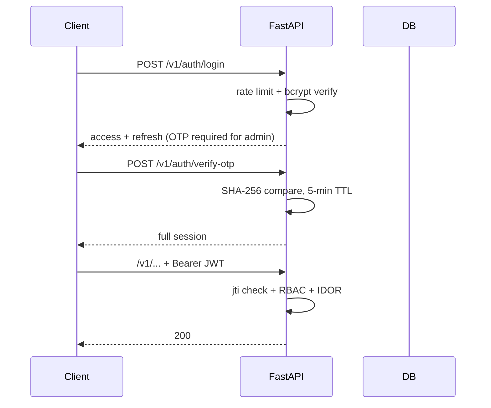

# API — BB-IMS: API Reference

| Field | Value |
| --- | --- |
| Version | v0.1 |
| Last Updated | 2026-08-06 |
| Owner | Backend Engineer |
| Status | In Review |

---

> OpenAPI docs served at `/docs`. All routes under `/v1/`.

## 1. Endpoint Inventory

### Auth
| Method | Path | Description | Rate limit |
| --- | --- | --- | --- |
| POST | `/v1/auth/login` | Login | 10/min |
| POST | `/v1/auth/verify-otp` | Verify OTP (2FA) | 3/10min |
| POST | `/v1/auth/refresh` | Refresh token | — |
| POST | `/v1/auth/logout` | Blacklist jti | — |

### Core CRUD (Admin for writes)
| Resource | Methods | Auth |
| --- | --- | --- |
| Students | GET, POST, PUT, PATCH, DELETE | Admin |
| Staff | GET, POST, PUT, PATCH, DELETE | Admin |
| Courses | GET, POST, PUT, PATCH, DELETE | Admin |
| Fees | GET, POST, DELETE (soft) | Admin |
| Attendance | POST bulk | Admin/Staff |
| Results | POST bulk | Admin/Staff |
| Leaves | CRUD | Role-based |
| Placements | CRUD | Admin |

### Analytics / ML
| Method | Path | Description |
| --- | --- | --- |
| GET | `/v1/analytics/at-risk` | At-risk students + SHAP |
| GET | `/v1/analytics/summary` | Full analytics summary |
| PUT | `/v1/admin/config/risk-thresholds` | Update thresholds |

## 2. Example: POST /v1/auth/login

Request: `{"username": "admin", "password": "..."}`
Response: `{"access_token": "...", "refresh_token": "...", "otp_required": true}`

## 3. Error Responses

Standardized via `ErrorCode` enum: `{"error": {"code": "...", "message": "..."}}`.

| Code | Meaning |
| --- | --- |
| 401 | Unauthorized (invalid/expired token) |
| 403 | Forbidden (RBAC/IDOR) |
| 422 | Validation error |
| 429 | Rate limited |
| 500 | Internal |

> Note: some guards currently return 403 for missing tokens where tests expect 401 — see ../project/Tracker.md BLK-001 (to be aligned).

## 4. Pagination

- Paginated responses include full metadata (page, size, total).

## 5. Auth Flow

## 6. Versioning Policy

- `/v1/` prefix; deprecation policy TBD — owner: Eng Lead, resolve by: Release 1.1.

## 7. Related Documents

| Document | Relationship |
| --- | --- |
| [TechSpec.md](TechSpec.md) | API layer |
| [Schema.md](Schema.md) | Tables behind endpoints |
| [SecurityAndCompliance.md](SecurityAndCompliance.md) | Auth + limits |
| [AppFlow.md](../design/AppFlow.md) | Flows |
| [PRD.md](../product/PRD.md) | Requirements |
| [Design.md](../design/Design.md) | UI rendering |
| [ImplementationPlan.md](../project/ImplementationPlan.md) | Tasks |
| [Tracker.md](../project/Tracker.md) | Status |
| [Rules.md](../project/Rules.md) | Standards |
| [Testing.md](Testing.md) | Contract tests |
| [Deployment.md](Deployment.md) | Deploy |
| [Glossary.md](../reference/Glossary.md) | Vocabulary |
| [RiskRegister.md](../project/RiskRegister.md) | Risks |
