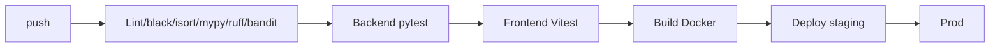

# Deployment — BB-IMS: Environments, CI/CD, Rollback

| Field | Value |
| --- | --- |
| Version | v0.1 |
| Last Updated | 2026-08-06 |
| Owner | DevOps Engineer |
| Status | In Review |

---

## 1. Service Topology

| Service | Purpose | Port |
| --- | --- | --- |
| web (nginx) | SPA + proxy | 80 |
| api | FastAPI | 8000 |
| celery | background | — |
| postgres | PG16 | 5432 |
| redis | broker/cache | 6379 |

## 2. CI/CD Pipeline

## 3. Environment Promotion

| Step | From | To | Trigger |
| --- | --- | --- | --- |
| 1 | main | staging | CI green |
| 2 | staging | prod | manual approval |

## 4. Rollback Procedure

- Docker image revert; `alembic downgrade` only with care.
- Risk-threshold config revert via admin endpoint.

## 5. Feature Flags

- Risk thresholds via `/v1/admin/config/risk-thresholds` (runtime).
- `ENV` variable switches SQLite ↔ PostgreSQL.

## 6. On-Call / Runbook

- **API 500s:** check PG + Redis.
- **Celery stuck:** restart worker; check Redis.
- **Desktop schema mismatch:** re-run migrations locally.
- **Auth issues:** verify SECRET_KEY rotation.

## 7. Related Documents

| Document | Relationship |
| --- | --- |
| [TechSpec.md](TechSpec.md) | Environments |
| [SecurityAndCompliance.md](SecurityAndCompliance.md) | Secrets |
| [PRD.md](../product/PRD.md) | Release criteria |
| [AppFlow.md](../design/AppFlow.md) | Flows |
| [Schema.md](Schema.md) | Migrations |
| [Design.md](../design/Design.md) | Design |
| [ImplementationPlan.md](../project/ImplementationPlan.md) | Rollout |
| [Tracker.md](../project/Tracker.md) | Status |
| [Rules.md](../project/Rules.md) | Standards |
| [API.md](API.md) | Endpoints |
| [Testing.md](Testing.md) | CI gates |
| [Glossary.md](../reference/Glossary.md) | Vocabulary |
| [RiskRegister.md](../project/RiskRegister.md) | Risks |
