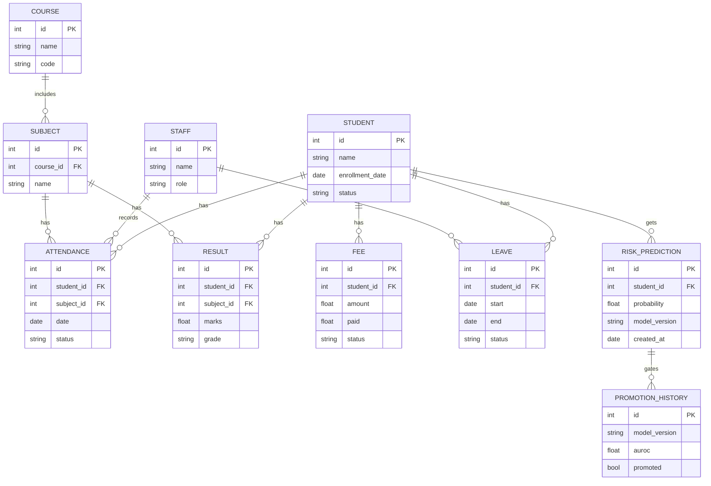

# Schema — BB-IMS: Data Model

| Field | Value |
| --- | --- |
| Version | v0.1 |
| Last Updated | 2026-08-06 |
| Owner | Data Engineer |
| Status | In Review |

---

> Core entities below map to the SQLAlchemy models + 3 Alembic revisions. Representative subset.

## 1. ER Diagram



## 2. Table/Collection Definitions

### TBL-student
| Field | Type | Nullable | Default | Constraints | Description |
| --- | --- | --- | --- | --- | --- |
| id | int PK | No | auto | — | PK |
| name | string | No | — | — | name |
| enrollment_date | date | No | — | — | enrolled |
| status | enum | No | active | active/inactive/graduated | state |

### TBL-attendance
| Field | Type | Nullable | Default | Constraints | Description |
| --- | --- | --- | --- | --- | --- |
| id | int PK | No | auto | — | PK |
| student_id | int FK | No | — | → student | student |
| subject_id | int FK | No | — | → subject | subject |
| date | date | No | — | — | day |
| status | enum | No | present | present/absent/late | state |

### TBL-risk_prediction
| Field | Type | Nullable | Default | Constraints | Description |
| --- | --- | --- | --- | --- | --- |
| id | int PK | No | auto | — | PK |
| student_id | int FK | No | — | → student | student |
| probability | float | No | — | 0..1 | risk |
| model_version | string | No | — | — | model |
| created_at | date | No | now() | — | when |

## 3. Relationships & Foreign Keys

| Table A | Table B | On delete | Justification |
| --- | --- | --- | --- |
| attendance | student | cascade | records follow |
| result | student | cascade | records follow |
| fee | student | cascade | records follow |
| risk_prediction | student | cascade | predictions follow |
| subject | course | restrict | course integrity |

## 4. Indexes

| Table | Index | Columns | Type | Reason |
| --- | --- | --- | --- | --- |
| attendance | idx_att_student_date | (student_id, date) | btree | attendance rate |
| result | idx_res_student_subject | (student_id, subject_id) | btree | marks lookup |
| fee | idx_fee_status | (status) | btree | collection rate |
| risk_prediction | idx_risk_student_time | (student_id, created_at) | btree | trend |

## 5. Enums / Constants

| Enum | Allowed values |
| --- | --- |
| student.status | active, inactive, graduated |
| attendance.status | present, absent, late |
| fee.status | paid, partial, pending |
| leave.status | pending, approved, rejected |
| ML features | 13 engineered from 5 tables |
| PSI thresholds | > 0.10 drifted, > 0.25 severe |

## 6. Data Lifecycle

- Seeder creates 5,000+ demo records.
- Soft-delete for students (status), hard delete only by admin.
- Risk predictions archived by model_version.

## 7. Migrations Strategy

- Tool: Alembic, 3 revisions.
- Rollback: `alembic downgrade -1`; round-trip tests.

## 8. Sample Record

```json
{
  "student": { "id": 1, "name": "Priya S.", "status": "active" },
  "attendance": { "student_id": 1, "subject_id": 3, "date": "2026-08-05", "status": "present" },
  "risk_prediction": { "student_id": 1, "probability": 0.87, "model_version": "xgb_v4" }
}
```

## 9. Data Validation Rules

| Field | DB constraint | App layer |
| --- | --- | --- |
| probability | 0..1 | Pydantic |
| marks | 0..100 | Pydantic |
| status enums | enum | Pydantic Literal |
| fee.paid ≤ amount | CHECK | service |

## 10. Sensitive Data Map

| Field | Sensitivity | Encrypted at rest? | Masked in logs? |
| --- | --- | --- | --- |
| student PII | PII | — | masked in logs |
| OTP hash | credential | SHA-256 | never logged |
| JWT jti | auth | — | — |
| fee data | financial | — | access-controlled |

## 11. Related Documents

| Document | Relationship |
| --- | --- |
| [API.md](API.md) | Endpoints touching tables |
| [TechSpec.md](TechSpec.md) | ORM |
| [PRD.md](../product/PRD.md) | Requirements |
| [AppFlow.md](../design/AppFlow.md) | Flows |
| [Design.md](../design/Design.md) | Display data |
| [ImplementationPlan.md](../project/ImplementationPlan.md) | Tasks |
| [Tracker.md](../project/Tracker.md) | Status |
| [Rules.md](../project/Rules.md) | Standards |
| [SecurityAndCompliance.md](SecurityAndCompliance.md) | Sensitive map |
| [Testing.md](Testing.md) | Data tests |
| [Deployment.md](Deployment.md) | Migrations |
| [Glossary.md](../reference/Glossary.md) | Vocabulary |
| [RiskRegister.md](../project/RiskRegister.md) | Risks |
