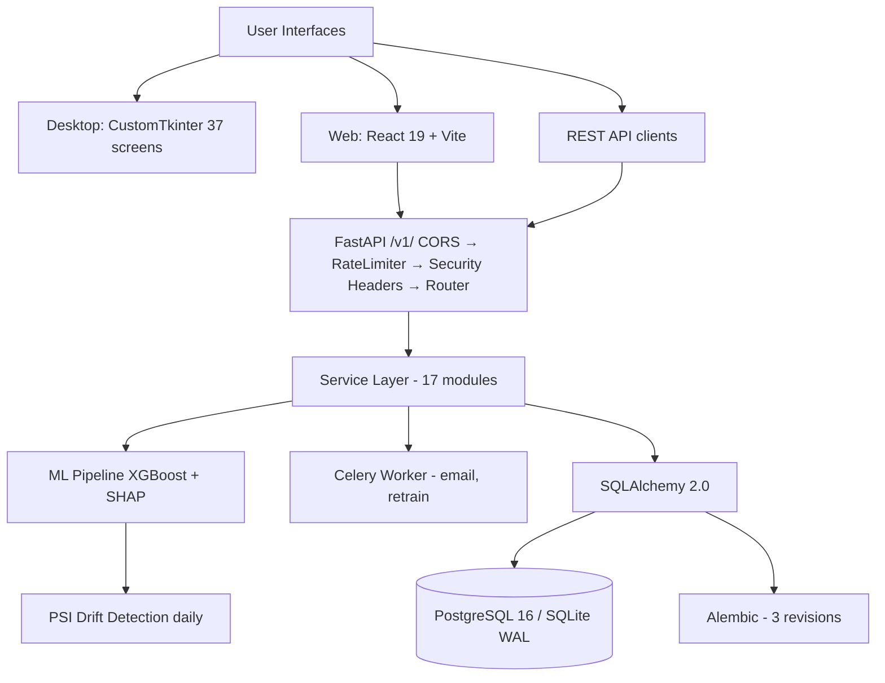
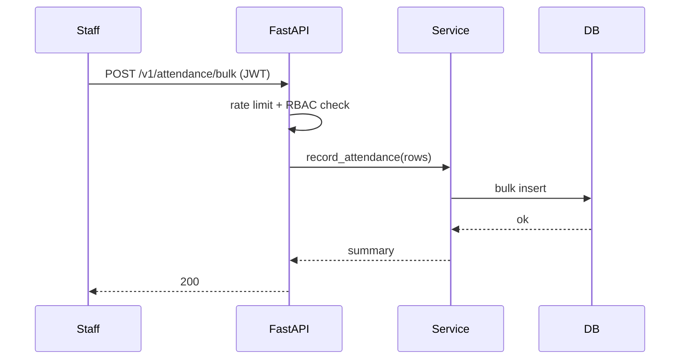
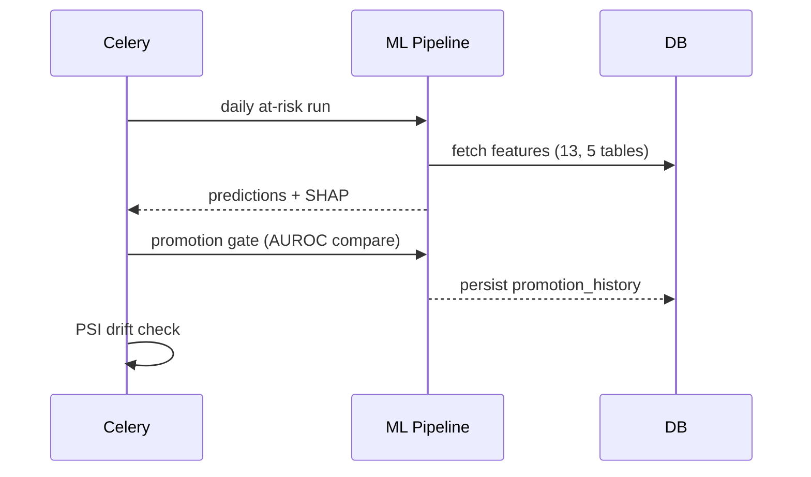
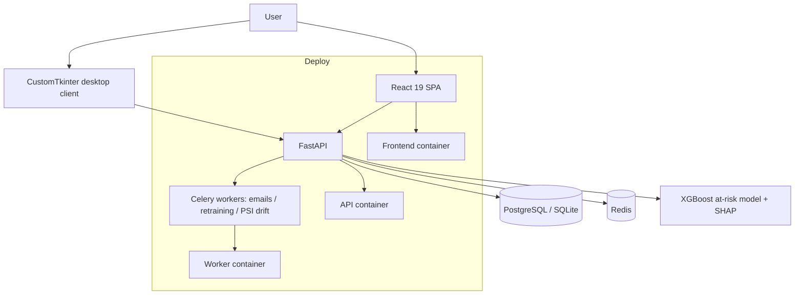

# TechSpec — BB-IMS: Technical Specification

| Field | Value |
| --- | --- |
| Version | v0.1 |
| Last Updated | 2026-08-06 |
| Owner | Engineering Lead |
| Status | In Review |

---

## 1. Architecture Overview

## 2. Tech Stack Table

| Layer | Technology | Version | Justification |
| --- | --- | --- | --- |
| Desktop UI | CustomTkinter | 5.2.x | Offline-capable client |
| Web UI | React 19 + Vite | 6.x | Fast SPA |
| API | FastAPI + Pydantic v2 | 0.115 | Typed, OpenAPI |
| ORM | SQLAlchemy | 2.0.x | Async-ready |
| DB | PostgreSQL / SQLite | 16 / WAL | prod/local |
| Migrations | Alembic | — | 3 revisions |
| Auth | bcrypt (cost 14) + PyJWT | — | jti blacklisting |
| ML | XGBoost + SHAP | — | at-risk model |
| Drift | PSI | — | distribution monitoring |
| Background | Celery + Redis | — | emails/retrain |
| Charts | Matplotlib/Seaborn (desktop), Recharts (web) | — | viz |
| Proxy | nginx (Alpine) | — | reverse proxy |
| Testing | pytest + Vitest | — | 348+/31+ |
| Quality | black, isort, mypy, ruff, bandit | — | gates |

## 3. System Components

| Component | Responsibility | Inputs → Outputs | Scaling | Failure Modes |
| --- | --- | --- | --- | --- |
| Desktop client | Offline UI (37 screens) | user → local DB | per-machine | stale schema |
| Web SPA | Browser UI | user → API | static + API | API down |
| FastAPI | API (50+ endpoints) | request → response | horizontal | auth errors |
| Service layer | Shared business logic (17 modules) | args → result | in-process | domain errors |
| ML pipeline | At-risk prediction + SHAP | features → risk | batch/daily | small data |
| Celery worker | Email, retrain | jobs → effects | add workers | Redis down |
| ORM | Persistence | models → rows | — | DB down |

## 4. Data Flow Diagrams

## 5. Third-Party Integrations

| Service | Purpose | Failure Fallback | Cost Model | Rate Limits |
| --- | --- | --- | --- | --- |
| Redis | Celery broker/cache | sync fallback | self-hosted | n/a |
| SMTP | Emails | logged failure | provider | provider |
| (none others) | — | — | — | — |

## 6. Non-Functional Requirements

| Category | Requirement | Target | How Verified |
| --- | --- | --- | --- |
| Performance | API p95 | < 300ms | metrics |
| Security | RBAC + IDOR + headers | enforced | tests |
| Availability | offline desktop | works w/o net | desktop |
| Scalability | bulk operations | 5,000+ rows | load test |
| Observability | structured logs | all requests | logs |

## 7. Environments

| Env | URL | Data | Deploy |
| --- | --- | --- | --- |
| dev | localhost:8000 / 5173 | SQLite seeded | manual |
| staging | staging | sample | CI |
| prod | prod:80 | PG16 | docker-compose |

## 8. Error Handling Strategy

- Standardized `ErrorCode` enum responses.
- Rate limiting: sliding-window per endpoint.
- Account lockout: 5 failures → 15-min freeze.
- Pydantic validation → 422.
- Idempotent bulk operations.

## 9. Observability

- Structured logs; Prometheus (roadmap).
- Drift alerts from Celery PSI task.
- Audit via promotion_history.

## 10. Technical Risks & Mitigations

| Risk | Mitigation |
| --- | --- |
| 401 vs 403 inconsistency | Document + align tests |
| ML small-data bias | Promotion gate + PSI |
| Tri-interface divergence | Shared service layer |

## Deployment Topology

## 11. Related Documents

| Document | Relationship |
| --- | --- |
| [PRD.md](../product/PRD.md) | Requirements |
| [Schema.md](Schema.md) | Data model |
| [API.md](API.md) | Endpoints |
| [AppFlow.md](../design/AppFlow.md) | Flows |
| [Design.md](../design/Design.md) | UI |
| [ImplementationPlan.md](../project/ImplementationPlan.md) | Phases |
| [Tracker.md](../project/Tracker.md) | Status |
| [Rules.md](../project/Rules.md) | Standards |
| [SecurityAndCompliance.md](SecurityAndCompliance.md) | Security |
| [Testing.md](Testing.md) | Tests |
| [Deployment.md](Deployment.md) | Deployment |
| [Glossary.md](../reference/Glossary.md) | Vocabulary |
| [RiskRegister.md](../project/RiskRegister.md) | Risks |
