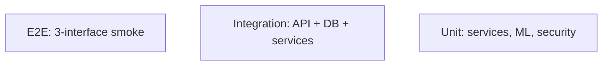

# Testing — BB-IMS: Test Strategy

| Field | Value |
| --- | --- |
| Version | v0.1 |
| Last Updated | 2026-08-06 |
| Owner | QA Engineer |
| Status | In Review |

---

## 1. Test Pyramid

## 2. Strategy

| Layer | Tool | Scope |
| --- | --- | --- |
| Unit | pytest | Service logic, ML, security rules |
| Integration | pytest | API ↔ DB, auth, RBAC, IDOR |
| Frontend | Vitest + RTL | React components, states |
| E2E | manual/docker-compose | 3-interface flows |

Current: 342 collected (pytest), 31+ Vitest. **3 failing auth tests** (BLK-001).

## 3. Critical Test Cases

| ID | Feature | Case | Expected |
| --- | --- | --- | --- |
| TC-001 | Auth | Protected endpoint without token | 401 (aligned) |
| TC-002 | Auth | Logout requires auth | 401 |
| TC-003 | Rate limit | Students headers present | 429 after budget |
| TC-004 | OTP | Wrong/expired OTP | Rejected |
| TC-005 | RBAC | Student accesses admin route | 403 |
| TC-006 | IDOR | Cross-user object access | 403 |
| TC-007 | ML | Promotion gate AUROC compare | history row |
| TC-008 | Drift | PSI synthetic shift | flagged |
| TC-009 | Bulk | Attendance bulk POST | 200 + rows |

## 4. Test Data Strategy

- Seeder (5,000+ records) + fixtures; isolated test DB.

## 5. CI Gates

- `pytest tests/` green (currently 3 auth failures — fix BLK-001).
- `npm test` (Vitest) green.
- bandit + mypy + ruff.

## 6. Related Documents

| Document | Relationship |
| --- | --- |
| [Rules.md](../project/Rules.md) | Test requirements |
| [PRD.md](../product/PRD.md) | Release criteria |
| [TechSpec.md](TechSpec.md) | Components |
| [AppFlow.md](../design/AppFlow.md) | Flow tests |
| [Schema.md](Schema.md) | Data tests |
| [API.md](API.md) | Contract tests |
| [Design.md](../design/Design.md) | UI tests |
| [ImplementationPlan.md](../project/ImplementationPlan.md) | Test tasks |
| [Tracker.md](../project/Tracker.md) | BLK-001 |
| [SecurityAndCompliance.md](SecurityAndCompliance.md) | Security tests |
| [Deployment.md](Deployment.md) | CI gates |
| [Glossary.md](../reference/Glossary.md) | Vocabulary |
| [RiskRegister.md](../project/RiskRegister.md) | Risks |
